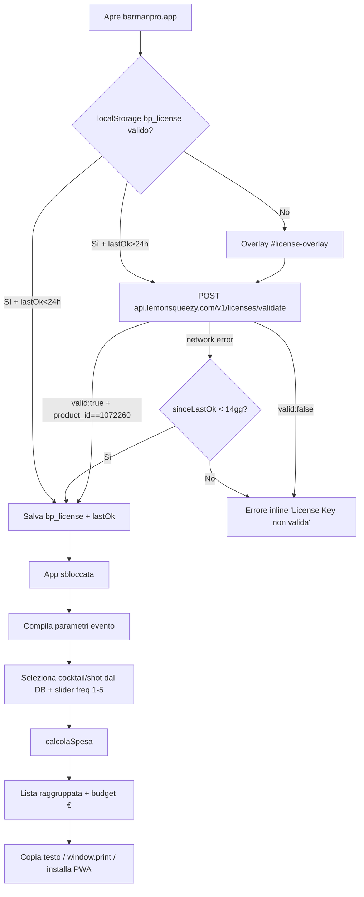
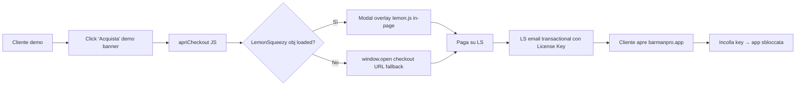

# AI_CONTEXT.md — Barman PRO

Knowledge base for LLM agents. Last update: 2026-05-20.
Owner: Samuele Racca (CF RCCSML04M05D205P, Italia). Email personale identità: raccasamuele2004@gmail.com. **Email business pubblica (support/sponsor/social/legal)**: barmanproapp@gmail.com.

---

## 1. Panoramica

- **Cos'è**: Progressive Web App single-file per barman/event planner che genera la lista della spesa per un evento (alcolici, analcolici, attrezzatura) + stima costi in EUR.
- **Input**: # ospiti, cocktail/persona, shot/persona, margine sicurezza %, nazione, fascia prezzo (bassa/media/alta), menu cocktail/shot scelti dal DB + frequenza relativa 1-5.
- **Output**: lista raggruppata per categoria (Litri + costo unitario stimato + budget totale), copiabile come testo plain WhatsApp-friendly, stampabile via `window.print()`.
- **Modello business**: vendita one-shot via Lemon Squeezy (Merchant of Record). 19,90 € IVA-inclusa. License key 3-activation never-expires. Demo gratuita pubblica come funnel.
- **Pubblico target**: barman professionisti IT/EU + organizzatori eventi privati.

---

## 2. Tech Stack & Servizi

| Layer | Tecnologia | Ruolo |
|---|---|---|
| Frontend | HTML5 + CSS vanilla + JS vanilla ES2020 | UI + logica calcolo. **NO framework, NO build step** |
| PWA | Service Worker (`sw.js`) + Web App Manifest (`manifest.json`) | Offline cache + installabilità native-app |
| i18n | Object literal `translations` in-memory, 7 lingue | Switch lingua runtime, persistito localStorage |
| Persistenza locale | `localStorage` chiave `barmanProState_v7` + `bp_license` | Stato sessione + chiave attivazione |
| Hosting FULL | Cloudflare Workers Assets su `barmanpro.app` (dominio custom registrato presso Cloudflare Registrar) | Versione a pagamento gated |
| Hosting DEMO | GitHub Pages su `raccasamuele.github.io/barman-pro/` da subdir `/docs` | Versione gratuita pubblica |
| Pagamenti | Lemon Squeezy (MoR) — store `barman-pro.lemonsqueezy.com` — product_id `1072260` — variant UUID `615640ad-5b95-44d2-95c7-b2b639a9ef89` | Checkout, IVA EU/UK/US, license-key emission, payout |
| Payout | Bonifico SEPA su IBAN Revolut EUR (****5067) | Versamento netto-fee |
| Auth/License | Lemon Squeezy API `POST /v1/licenses/validate` (`application/x-www-form-urlencoded`, body `license_key=…`) | Validazione runtime |
| Font web | Google Fonts: `Cinzel` (400-800) + `Manrope` (200-800) | Display serif + body sans |
| Librerie esterne | `lemon.js` (`https://assets.lemonsqueezy.com/lemon.js`) **solo in `docs/index.html`** | Checkout overlay modale |
| Repo | GitHub `raccasamuele/barman-pro` (privato), 39+ commit, deploy via upload web | Source of truth |

**NESSUN backend custom.** Nessun DB. Nessuna API custom. Nessun build tool (Webpack/Vite/etc). `package.json` esiste solo per script Node di sviluppo (`pdf-lib`, `docx` per generazione PDF ricettario offline) — **non parte del deploy**.

---

## 3. Architettura & Struttura

```
barman-pro/
├── index.html                  → APP FULL (3374 righe, monolitica: HTML+CSS+JS inline)
├── sw.js                       → Service Worker PWA (v1.0.1)
├── manifest.json               → PWA manifest
├── eula.html                   → EULA IT/EN
├── privacy.html                → Privacy Policy GDPR IT/EN (provider hosting = Cloudflare)
├── LEGGIMI.txt                 → Istruzioni cliente post-acquisto
├── LICENSE                     → EULA software (copyright)
├── LICENSE-PDF                 → Licenza CC BY-NC-ND 4.0 del PDF ricettario
├── favicon.svg, icon-*.png     → Asset PWA (192, 512, maskable-512, apple-touch)
├── Cocktail_IBA_adattamento_a_feste.pdf   → Ricettario IT 102 IBA party-adapted (6.4MB, 36pp)
├── Cocktail_IBA_party_adaptation.pdf      → Ricettario EN equivalente (4.3MB)
├── _redirects                  → CF Pages routing (vuoto: redirect 404 non supportati su Workers Assets)
├── _headers                    → CF Pages HTTP headers (noindex, no-cache su sw.js)
├── .assetsignore               → Esclude .git, node_modules, .docx, .zip, file dev/marketing dal deploy CF
├── barman-pro-full-v1.0.zip    → Pacchetto consegnato al cliente come backup (10MB, 15 file)
│
├── docs/                       → DEMO PUBBLICA (GitHub Pages, sottocartella stessa repo)
│   ├── index.html              → App demo (2553 righe) — stessa UI, limiti hardcoded
│   ├── eula.html, privacy.html → Copie pagine legali per la demo
│   ├── preview-it.html         → Landing pubblicitaria ricettario IT
│   ├── preview-en.html         → Landing pubblicitaria ricettario EN
│   ├── sitemap.xml, robots.txt → SEO (FULL invece è noindex)
│   └── icons + favicon         → Asset demo
│
├── scripts/                    → Node CLI tool dev-only (NON deployati)
│   ├── inject_legal.js         → Inietta EULA+Privacy nel monolito
│   ├── inject_style.js         → Patch CSS
│   ├── merge_index.js          → Sync docs/index.html ← index.html con diff demo
│   ├── check_docs_index.js     → Lint: verifica che demo non leaki feature PRO
│   └── render-barman-promo.js  → Generazione screenshot promo via puppeteer
│
├── temp_backup/, _audit_unzip/ → Cartelle locali NON pushate, NON deployate
└── package.json                → Solo dev dependencies (pdf-lib, docx, ffmpeg)
```

**Critical files**:
- `index.html` linea 1401-3344: tutto il JS (license, i18n, calcolo, PWA, PDF modal).
- `index.html` linea 2333-2410: `prezziBase` (75+ ingredienti × 3 fasce).
- `index.html` linea 2412-2430: `indiciGeo` (66 paesi).
- `index.html` linea 2448 onwards: `databaseDrink` (64 ricette HV).
- `index.html` linea 3093-3227: modulo licenza Lemon Squeezy.

---

## 4. Logiche di Business

### 4.1 Pricing engine

```
costo_ingrediente_evento = arrotondaSu0.5( (ml_totali / 1000) × prezzoBase[ing][fascia] × indiciGeo[nazione] )
```

- `prezzoBase`: hardcoded €/L per 75+ ingredienti × 3 fasce (`bassa` | `media` | `alta`).
- `indiciGeo`: moltiplicatore relativo (Italia=1.00, base). Islanda=3.39 max, Argentina=0.50 min.
- Attrezzatura: keys con underscore (`_ghiaccio_kg`, `_bicchiere_pz`, `_bicchierino_shot_pz`, `_cannuccia_pz`) prezzo unico (non dipende da fascia ma da nazione).
- **Arrotondamento**: tutti i costi unitari arrotondati per eccesso al mezzo euro (`Math.ceil(c * 2) / 2`); litri arrotondati al mezzo litro.
- Ghiaccio: ipotesi 100g/cocktail → `kgGhiaccio = ceil(drinkTotali * 100 / 1000)`.

### 4.2 Calcolo quantità

```
drinkTotali = ceil( ospiti × drinkTesta × (1 + scarto/100) )
shotTotali  = ceil( ospiti × shotTesta  × (1 + scarto/100) )
```

Distribuzione drink: ogni cocktail nel menu ha `peso ∈ [1,5]` → quantità = `ceil(drinkTotali × peso / sommaPesi)`. Stesso schema per shot. Shot: dose fissa **40 ml** per ingrediente.

### 4.3 Flusso utente (FULL)



### 4.4 Flusso acquisto (DEMO → FULL)



### 4.5 Differenze DEMO vs FULL

| Feature | DEMO `docs/index.html` | FULL `index.html` |
|---|---|---|
| Database cocktail | 20 ricette hardcoded | 64 ricette HV |
| Menu serata max | `DEMO_LIMITE_DRINK = 3`, `DEMO_LIMITE_SHOT = 2` | Illimitato |
| Cocktail/shot custom | Disabilitato (overlay PRO) | Abilitato |
| Ricettario PDF | Solo preview-it/preview-en come marketing | PDF completo embedded + download |
| Watermark export | `demoFooter: "Generato con la versione DEMO"` | Pulito |
| License key gate | Assente | Obbligatorio |
| Indicizzazione SEO | `index, follow` + sitemap | `noindex, nofollow, noarchive` |
| Lemon.js script | Caricato (per checkout overlay) | Non caricato |

---

## 5. Dati & Stato

### 5.1 Schemi runtime (no DB persistente)

```javascript
// localStorage["barmanProState_v7"]
{
  menuSerataDrink: { "Negroni (HV)": 3, "Spritz (HV)": 5 },  // peso freq 1-5
  menuSerataShot:  { "Jägermeister": 2 },
  customShots:     ["Limoncello"],                           // shot extra user-added
  customDrinks:    { "Mio Cocktail": [{nome,tipo,ml}, ...] }, // cocktail user-defined
  lingua: "it" | "en" | "es" | "fr" | "de" | "pt" | "nl",
  config: {
    ospiti: number, drink_testa: number, shot_testa: number,
    scarto: number, nazione: string, fascia: "bassa"|"media"|"alta"
  }
}

// localStorage["bp_license"]
{
  key: "XXXX-XXXX-XXXX-XXXX",
  lastOk: timestamp_ms,        // ultimo successo validazione
  lastTry: timestamp_ms,
  validProduct: "Barman PRO"
}
```

### 5.2 Strutture in-memory hardcoded

```javascript
prezziBase: { ingrediente: {bassa:€/L, media:€/L, alta:€/L} } // 75+ keys
indiciGeo:  { Paese: float }                                    // 66 keys (1.00 = Italia base)
databaseDrink: { "Nome (HV)": [{nome:string, tipo:"alcolico"|"analcolico", ml:int}, ...] }
aliasIngredienti: { "vodka": "Vodka Liscia", ... }              // normalizzazione case-insensitive
translations: { lang: { chiave: string, ing: {originale: tradotto} } } // i18n 7 lingue
```

### 5.3 Costanti license

```javascript
STORAGE_KEY = 'bp_license'
REVALIDATE_AFTER_MS = 24 * 60 * 60 * 1000           // 24h: revalida online
GRACE_PERIOD_MS     = 14 * 24 * 60 * 60 * 1000      // 14gg: offline tolerato
API_VALIDATE        = 'https://api.lemonsqueezy.com/v1/licenses/validate'
EXPECTED_PRODUCT_ID = 1072260                         // gate anti-key-cross-product
```

---

## 6. Integrazioni & API

### 6.1 Lemon Squeezy License Validation

```http
POST https://api.lemonsqueezy.com/v1/licenses/validate
Content-Type: application/x-www-form-urlencoded
Accept: application/json

license_key=XXXX-XXXX-XXXX-XXXX
```

Response success:
```json
{
  "valid": true,
  "license_key": { "status": "active", "key": "...", "activation_limit": 3, ... },
  "meta": { "product_id": 1072260, "product_name": "Barman PRO", ... }
}
```

Gate logic: `data.valid===true && Number(data.meta.product_id)===1072260`. CORS supportato dal browser (Origin header del dominio `barmanpro.app` accettato).

### 6.2 Lemon Squeezy Checkout

- Storefront page: `https://barman-pro.lemonsqueezy.com`
- Direct checkout URL (skipps storefront): `https://barman-pro.lemonsqueezy.com/checkout/buy/615640ad-5b95-44d2-95c7-b2b639a9ef89`
- Embed overlay: stessa URL + `?embed=1` + caricamento `lemon.js` + click su `<a class="lemonsqueezy-button">` → intercettato e mostrato come modal in-page.
- Affiliate: programma attivabile in Settings → Affiliates (commission default suggerita: 30%).

### 6.3 Service Worker (`sw.js`)

- `CACHE_VERSION = 'barman-pro-v1.0.1'` — **bumpa ogni release**, altrimenti i client cached non ricevono fix.
- Strategy:
  - **HTML** (`mode==='navigate'` o `.html`): network-first, fallback cache.
  - **PDF**: network-first.
  - **Cross-origin** (font Google): bypass SW, gestito dal browser.
  - **Tutto il resto** (CSS/JS/img inline da stessa origin): cache-first.
- `cache.addAll([…PRECACHE_ASSETS])` è **atomico**: 1 solo 404 = niente cachato. PRECACHE deve contenere solo file realmente presenti nel deploy.
- Non registrato sotto `file://` (line 3297 check protocol).

### 6.4 Lemon Squeezy email transazionale

Template configurato in LS Settings → Emails → Order Confirmation. Include `{{license_key}}` placeholder. Testo customizzato istruisce di andare su `https://barmanpro.app` (non doppio-click sullo zip).

---

## 7. Edge Cases & Decisioni Architetturali

### 🔴 Critici (build-breaking se ignorati)

1. **`cache.addAll` SW è atomico** → se un asset nel `PRECACHE_ASSETS` manca, NESSUN file viene cachato. Mantieni la lista sincronizzata con i file effettivamente presenti.
2. **License da `file://` impossibile**: `fetch` ha Origin null → blocco CORS. Cliente DEVE aprire `https://barmanpro.app`, **non** doppio-click su index.html dello zip. LEGGIMI.txt lo spiega esplicitamente.
3. **`_redirects` Cloudflare Workers Assets accetta solo status 200/301/302/303/307/308** (non 404 come Netlify). File ora vuoto/commenti only. Sintassi `404!` di Netlify rompe il deploy.
4. **`.assetsignore` obbligatorio**: senza, CF Workers Assets pubblica `.git/` come asset statici (security leak: `/.git/index` scaricabile). File esclude `.git/`, `node_modules/`, `.docx`, `.zip`, sorgenti.
5. **SW deve usare path relativi** (`./`, no `/`) per funzionare sia in deploy root sia in sotto-path (es. `/docs/` di GH Pages).
6. **Service Worker NON registrato sotto `file://`** (line 3297 protect): senza, `register()` lancia errore non-critico ma blocca console.

### 🟡 Decisioni che potrebbero sembrare strane

7. **Monolito unico file `index.html`**: scelta deliberata. Niente bundler. App distribuibile via singolo download. JS inline in `<script>` finale, ~1940 righe. Trade-off: parse iniziale lento ma zero round-trip aggiuntivi.
8. **Database cocktail "(HV)" suffix**: indica "High Volume" — versione semplificata della ricetta IBA originale per servizio batch ad eventi (riduzione ingredienti complessi, sciroppi pre-mixati implied). Il PDF ricettario contiene 102 ricette IBA + adattamenti party; il DB JS solo 64 di quelle high-volume.
9. **Pesi 1-5 invece di percentuali**: UX scelta. Slider intuitivo > input numerico %. Internamente normalizzato (`peso / sommaPesi`).
10. **Arrotondamento aggressivo per eccesso (+0,5€)**: deliberato. Cliente del barman preferisce avanzo a mancanza. Mai sotto stima.
11. **`indiciGeo` Italia=1.00**: base reference. Listing prezzi originale tarato su mercato italiano 2026.
12. **Manifest `theme_color: #722F37` e `background_color: #F5EEDC`** sono valori legacy (palette bordeaux/crema dell'iterazione precedente). UI attuale è dark+oro. Non corretto per coerenza ma non blocca install PWA. Splash screen iOS userà quei valori, non i CSS.
13. **`STORAGE_KEY = 'barmanProState_v7'`**: il `_v7` suggerisce 6 rotture di schema precedenti. Su breaking change futuri, bumpa a `_v8` per invalidare sessioni vecchie senza migration.
14. **Mobile PDF NON in iframe**: iOS Safari non renderizza PDF in iframe. Su mobile (UA match o `innerWidth<700`), si crea anchor temporaneo `target="_blank"` con `.click()` invece di `window.open()` (che da PWA standalone lancerebbe browser esterno).
15. **License: grace period 14gg + revalidate 24h**: se LS API è down → cliente non bloccato. Se cliente refunda dopo 30gg → LS marca key revoked → next revalidate la app si chiude.
16. **`docs/index.html` è una COPIA divergente** di `index.html`, non un build artifact. Modifiche vanno propagate manualmente o via `scripts/merge_index.js`. Tipico drift atteso.
17. **`og:image` punta a `https://barmanpro.app/icon-512.png`**: hack. Vero og-image 1200×630 non esiste, si usa icona quadrata 512 come fallback. Anteprime social vengono croppate male su FB/Twitter. TODO: generare vero og-image.
18. **Demo blocca features PRO via overlay UI, NON server-side**: la limitazione (3 cocktail max, custom disabled, watermark export) è solo CSS+JS. Bypassabile da DevTools. Accettato: la value-add reale è il DB completo+PDF che la demo non ha proprio.
19. **`apriCheckout()` ha doppio fallback**: prima `LemonSqueezy.Url.Open()` (overlay nice), fallback `window.open()` se lemon.js bloccato da ad-blocker.
20. **Cliente di prova auto-rimborsabile entro 24h** da LS dashboard: NON paghi fee di transazione se rimborsato in finestra.

### 🟢 Coerenze importanti

21. URL paid version: **sempre** `https://barmanpro.app` (mai netlify, mai workers.dev, mai pages.dev — quelli erano stati intermedi).
22. Indirizzo support pubblico (clienti/sponsor/social/legal): **sempre** `barmanproapp@gmail.com`. La mail personale `raccasamuele2004@gmail.com` resta privata, mai esposta nei file deployati.
23. Product ID stabile finché non elimini+ricrei il prodotto su LS (modifiche a prezzo/titolo/copy non lo cambiano). **Test mode e Live mode hanno product_id DIVERSI** — sono ambienti separati. Test mode era 1047474, Live mode è 1072260.

---

## 8. UI / Branding

### Palette CSS (root variables)

```css
--bg-color: #0d0d0f               /* near-black, body */
--glass-bg: rgba(22,22,22,0.75)   /* card semi-transparent */
--glass-border: rgba(255,255,255,0.12)
--glass-shadow: 0 20px 50px rgba(0,0,0,0.8)

--text-main: #fcfcfc              /* corpo */
--text-muted: #999999
--text-dark: #0a0a0a

--accent-gold-1: #EAD0A1          /* gold chiaro highlight */
--accent-gold-2: #B38E46          /* gold profondo / brand */
--accent-glow: rgba(212,175,55,0.35)

--input-bg: rgba(12,12,12,0.85)
--input-border: rgba(255,255,255,0.2)
--input-focus: rgba(234,208,161,0.8)

--danger-color: #ff4a4a
--success-color: #4aff8f
--brand-color: #B38E46
```

Palette legacy (solo manifest PWA splash, non più usata in UI):
- bordeaux `#722F37`, crema `#F5EEDC`.

### Font

- **Display**: `Cinzel` (serif romano, eleganza editoriale) — pesi 400-800 — usato per `h1/h2/h3`, brand subtitle, prezzi.
- **Body**: `Manrope` (sans-serif geometrico moderno) — pesi 200-800 — usato per testo, label, button, input.
- Caricati via Google Fonts CSS2 API: 1 request `<link rel="stylesheet">`.

### Naming/copy chiave

- Brand display: `Barman PRO`
- Tagline header: `Calcolatore d'Eventi`
- Section ornaments: caratteri Unicode `&#10022;` (✦), `&#10086;` (❦), `&#8615;` (↓), `&#10010;` (✚)
- Toast prefix: `❖`
- Header copy: `Stato salvato automaticamente`
- Reset CTA: `Azzera tutto`
- Primary CTA generate: `Genera lista della spesa`
- Footer: `© 2026 Samuele Racca · Tutti i diritti riservati`
- Lingue UI: 7 (it default, en, es, fr, de, pt, nl) — select con flag emoji 🇮🇹🇬🇧🇪🇸🇫🇷🇩🇪🇵🇹🇳🇱

---

## 9. Istruzioni Operative

### Sviluppo locale (NO build)

```bash
# Apri direttamente in browser locale per dev rapido (limitazione: PWA + license validation NON funzionano da file://)
# Per testarli, serve un server HTTP locale:
npx http-server . -p 8080
# oppure
python -m http.server 8080
# poi → http://localhost:8080
```

### Script Node interni (dev-only)

```bash
npm install                              # solo per pdf-lib, docx, ffmpeg (NON parte del deploy)
node scripts/inject_legal.js             # rebuild eula+privacy
node scripts/merge_index.js              # propaga index.html → docs/index.html con diff demo
node scripts/check_docs_index.js         # lint anti-leak feature PRO nella demo
node scripts/render-barman-promo.js      # genera screenshot promo via puppeteer
```

### Deploy

**FULL → barmanpro.app (Cloudflare Workers Assets)**:
1. Modifica file root → upload manuale su GitHub web ("Add files via upload" o "Edit") sul branch `main`.
2. Cloudflare auto-rebuild via webhook GitHub → ~30-60 sec → live.
3. **NB**: bumpa `CACHE_VERSION` in `sw.js` ad ogni release significativa, altrimenti i client già installati non ricevono fix.

**DEMO → raccasamuele.github.io/barman-pro (GitHub Pages)**:
1. File in `docs/` → push → GH Pages auto-rebuild ~1-2 min.

**ZIP cliente**:
```powershell
# da root del progetto, PowerShell
Compress-Archive -Path index.html,sw.js,manifest.json,eula.html,privacy.html,LEGGIMI.txt,LICENSE,LICENSE-PDF,favicon.svg,apple-touch-icon.png,icon-192.png,icon-512.png,icon-maskable-512.png,Cocktail_IBA_adattamento_a_feste.pdf,Cocktail_IBA_party_adaptation.pdf -DestinationPath barman-pro-full-v1.0.zip -Force
```

### Test checklist post-deploy

| URL/Action | Atteso |
|---|---|
| `https://barmanpro.app` | Overlay license + SSL valid |
| `/eula.html`, `/privacy.html` | Renderizzano contenuto legale |
| `/sw.js` | Header `Cache-Control: no-cache` |
| `/.git/index` | 404 (verifica `.assetsignore` funziona) |
| DevTools → Application → Manifest | "Install app" disponibile |
| DevTools → Application → SW | `sw.js` activated |
| Demo button "Acquista" | Apre LS modal overlay (con lemon.js) |
| Acquisto LS test mode | Email arriva con `{{license_key}}` |
| License key valida su `barmanpro.app` | Sblocca app, `bp_license` in localStorage |
| License key di altro prodotto LS | Errore "non valida per Barman PRO" (gate product_id) |

---

## 10. State of the launch (snapshot 2026-05-20)

- ✅ Audit codice completato (W1-W7 + 🔴 critici risolti)
- ✅ Deploy Cloudflare Workers Assets live su `barmanpro.app`
- ✅ Demo live su `raccasamuele.github.io/barman-pro/`
- ✅ Lemon Squeezy in **Live mode**, prodotto pubblicato, prezzo €19,90
- ✅ License key (3 activations, never expires) configurate
- ✅ Email transazionale custom (IT+EN) con istruzioni `barmanpro.app`
- ✅ Legal links store-wide LS su `barmanpro.app/eula.html` + `/privacy.html`
- ✅ Payout: IBAN Revolut EUR ****5067, Tax info "Submitted"
- ✅ Checkout overlay via `lemon.js` + direct checkout URL `?embed=1`
- ⏳ TODO go-live: acquisto test con carta reale + refund entro 24h
- ⏳ TODO marketing: Instagram/TikTok reels, Lemon Squeezy Affiliates (commission 30%), outreach scuole bartending

---

*Fine knowledge base. Per dubbi su decisioni non documentate qui, contattare barmanproapp@gmail.com (support pubblico).*
